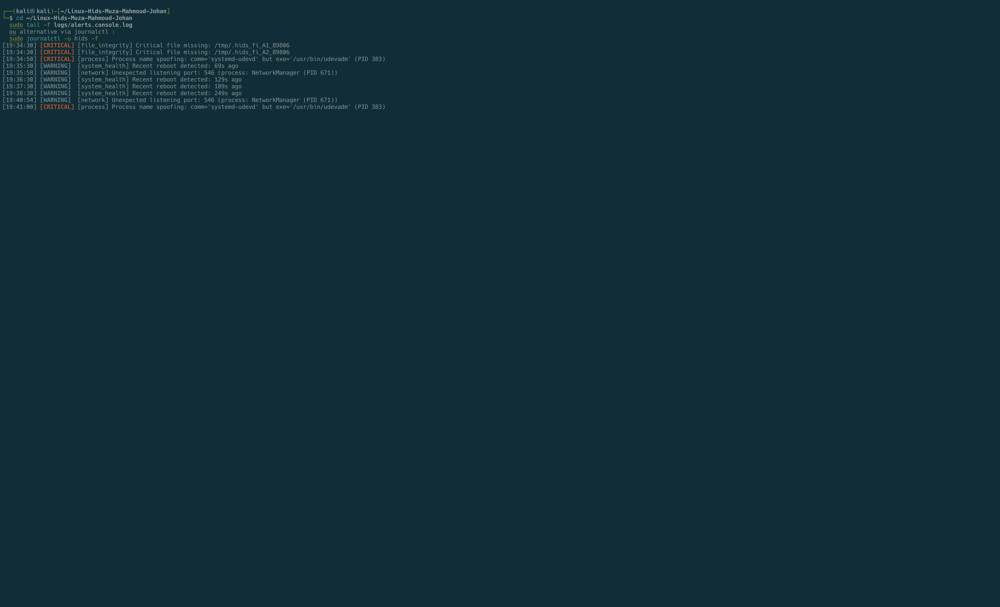
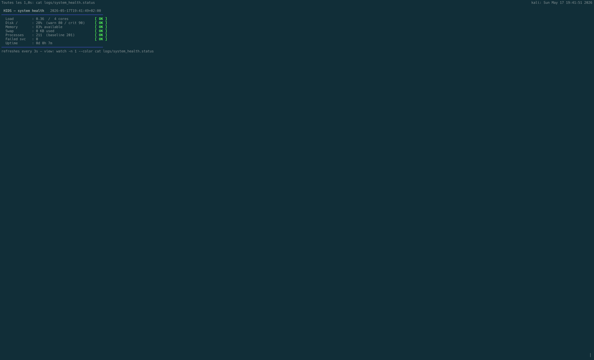
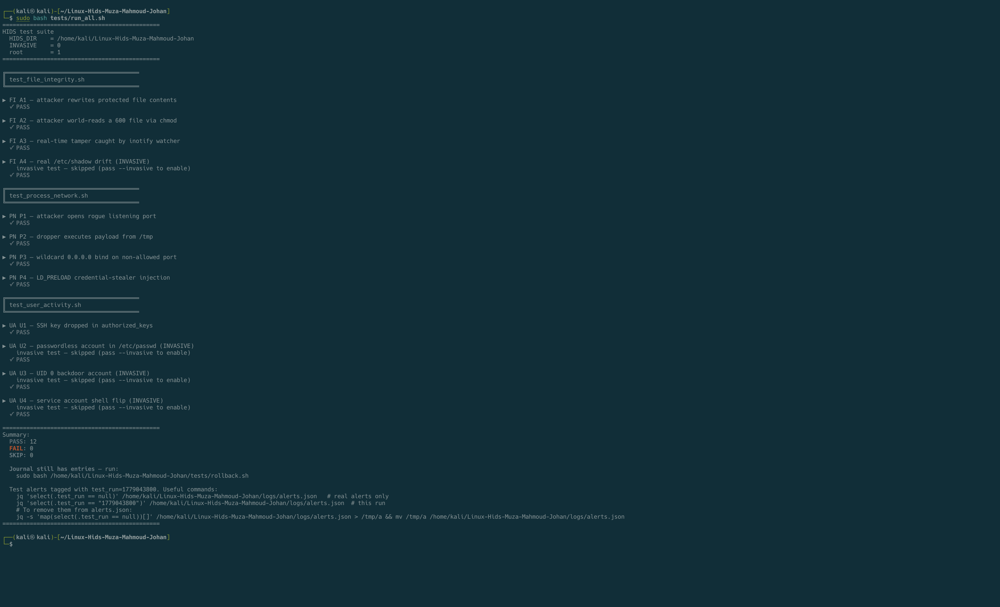

# Linux HIDS

A Bash-based Host Intrusion Detection System for Linux. Detects compromise indicators across file integrity, account activity, running processes, open ports, and system health. Built as a BeCode team project by **Mahmoud Hasan**, **Johan-Emmanuel Hatchi**, and **Muza** (more in [`Team and contributions`](#team-and-contributions)).

[](https://github.com/Jhatchi/Linux-Hids-Muza-Mahmoud-Johan/actions/workflows/shellcheck.yml)
[](#requirements)
[](#requirements)
[](#requirements)
[](LICENSE)
[](https://www.linkedin.com/in/johan-emmanuel-hatchi/)

## Screenshots

**Live alerts feed** (`logs/alerts.console.log`) during an attack simulation:



Real-time CRITICAL and WARNING alerts caught by `file_integrity`, `process_network`, and `system_health` modules. Process-name spoofing (`comm=systemd-udevd` but `exe=/usr/bin/udevadm`), rogue listening port, and critical file tampering detected within seconds.

<details>
<summary><strong>Live system health dashboard</strong> (refreshes every 3s)</summary>



Auto-refreshed colored snapshot of CPU load, disk, memory, swap, process count, failed services, and uptime. Green `[OK]` labels mean the host is within baseline thresholds. Updates to `logs/system_health.status` every 3 seconds.

</details>

## ⚠ Operational notice

**Designed for lab use and for production deployment on hosts you own or administer.** The HIDS reads sensitive files (`/etc/shadow`, `/proc/<pid>/exe`, the audit log) and requires root. Always review the auditd rules in `install.sh` and the file lists in `config/` before deploying on a production host: the rule set is opinionated and may produce false positives in your environment.

The test suite under `tests/` is **invasive**: it modifies real users, real `/etc/shadow`, and drops files in `/tmp`. Every destructive step is journaled and reversible via `tests/rollback.sh`, but run it only on a host you can fully restore (snapshot the VM first).

## What it does

- **4 detector modules run in parallel** under a Bash supervisor (`controller.sh`), each focused on one signal: file integrity (`/etc/passwd`, `/etc/shadow`, sudoers, SSH keys, critical binaries), user activity (new users, UID 0 backdoors, off-hours logins, authorized_keys drift), process and network (rogue ports, exec from `/tmp`, hidden processes, LD_PRELOAD), system health (resource exhaustion, error spikes, abnormal process counts).
- **2 event-driven companions for sub-second latency**: `inotifywait` on critical files, and `tail -F /var/log/audit/audit.log` filtered by auditd keys (`user_modify`, `priv_escalation`, `persistence`, `ssh_config`).
- **Centralized alerting** to a SIEM-ready JSON log (`logs/alerts.json`) with deduplication, severity levels, and a 3-stage correlation pipeline (`auditd_parser` then `enrichment` then `correlation_engine`) that catches multi-signal patterns ("shell spawned + outbound socket = reverse-shell indicator").

## Architecture

```text
┌─────────────────────────────────────────────────────────┐
│                      controller.sh                       │
│                    (supervisor / PID 1)                  │
│                                                          │
│   crash-loop guard · kill_tree() · alert tail            │
└──────┬──────────────────────────────────────────────────┘
       │ supervises (restart-on-death)
       │
   ┌───┴────┬────────┬─────────┬──────┬──────────┬────────┐
   │        │        │         │      │          │        │
   ▼        ▼        ▼         ▼      ▼          ▼        ▼
 file_   user_   process_   system_  ua_     fi_      sh_
 integ.  activ.  network    health   events  events   dashboard
   │        │        │         │       │        │        │
   └────────┴────────┴─────────┴───────┴────────┴────────┘
                         │
                         ▼
                   alerting.sh
                   ├── logs/alerts.json         (SIEM-ready, deduped)
                   └── logs/alerts.console.log  (live tail feed)
```

**Why a supervisor?** If one module crashes or hangs, the others keep running and the supervisor relaunches the failed one. A crash-loop guard (3 crashes in 300s, then 300s cooldown) prevents hot-loops.

**Correlation pipeline** (`auditd_parser` then `enrichment` then `correlation_engine`) runs on a separate timer inside the supervisor. It correlates raw events across modules and fires higher-confidence alerts (example: "shell spawned + outbound socket = reverse-shell indicator").

## Quick start

On a Linux host (Debian/Ubuntu/RHEL family), as root:

```bash
git clone https://github.com/Jhatchi/Linux-Hids-Muza-Mahmoud-Johan.git && cd Linux-Hids-Muza-Mahmoud-Johan
sudo bash install.sh                    # auto-installs auditd, bc, inotify-tools, jq, deploys auditd rules
sudo bash main.sh --init && sudo bash main.sh   # capture baseline, then start the supervisor (foreground)
```

**As a systemd service** (after `install.sh`):

```bash
sudo systemctl enable --now hids && sudo systemctl status hids
```

Live alerts tail in the supervisor terminal. JSON alerts go to `logs/alerts.json`. Full operator guide below.

## Uninstall

To remove HIDS completely from a host (service, auditd rules, project files):

```bash
# 1. Stop and disable the systemd service
sudo systemctl stop hids
sudo systemctl disable hids
sudo rm /etc/systemd/system/hids.service
sudo systemctl daemon-reload

# 2. Remove the auditd rules deployed by install.sh
sudo rm /etc/audit/rules.d/hids.rules 2>/dev/null
sudo augenrules --load 2>/dev/null
sudo systemctl restart auditd

# 3. Kill any leftover HIDS process
sudo pkill -f "Linux-Hids-Muza-Mahmoud-Johan" 2>/dev/null
sudo pkill -f "modules/" 2>/dev/null
sudo pkill -9 -f "inotifywait.*etc" 2>/dev/null

# 4. Remove the project directory (baselines, logs, run)
cd ~
sudo rm -rf Linux-Hids-Muza-Mahmoud-Johan
```

**Sanity check:**

```bash
systemctl status hids 2>&1 | head -1   # "Unit hids.service could not be found."
sudo auditctl -l                        # "No rules"
ps -ef | grep -E "modules/|inotifywait.*etc" | grep -v grep   # empty
```

Dependencies installed by `install.sh` (`auditd`, `bc`, `inotify-tools`, `jq`) are intentionally **not** removed: they may be used by other tools on the host. Remove them manually with your package manager if needed.

## Team and contributions

Four-day BeCode bootcamp team project. Three contributors, each with their own GitHub identity in the commit history:

| Contributor | Focus |
|---|---|
| **Mahmoud Hasan** ([MahmoudHasan83](https://github.com/MahmoudHasan83)) | Lead developer: supervisor architecture (`controller.sh`, `main.sh`, `install.sh`), test harness (`tests/*.sh`), config files, auditd rules deployment, correlation pipeline. Held the keyboard for most of the production code, including modules co-developed in pair with the rest of the team. |
| **Johan-Emmanuel Hatchi** ([Jhatchi](https://github.com/Jhatchi)) | Phase 1 research on the 6 HIDS detection modules (file integrity, user activity, process and network, system health, plus event-driven and dashboard companions), pair-programming on the detectors, repository metadata, license, CI workflow, README refinements. |
| **Muza** ([minarokova-design](https://github.com/minarokova-design)) | Initial project scaffolding, original README, project documentation, pair-programming on the detectors and on the research phase. |

The team worked in **pair-programming sessions** for most of the detector logic: design decisions on detection signals, false-positive thresholds and alert wording were collective. Commits often landed under one person's name (whoever was holding the keyboard), so `git log` does not fully reflect the collaboration. Each member's own GitHub identity is still present in the commit history for the work they pushed directly.

## Modules

**4 polling detectors** (run on a timer, restart-on-death via supervisor):

| Module | What it catches |
|---|---|
| `file_integrity` | Tampering of `/etc/passwd`, `/etc/shadow`, sudoers, SSH host keys, critical binaries: content, permissions, ownership |
| `user_activity` | New users, UID 0 backdoors, passwordless accounts, service-account shell flips, SSH `authorized_keys` drift, failed login bursts, off-hours root logins |
| `process_network` | Rogue listening ports, execution from `/tmp`, hidden processes (rootkit indicator), `LD_PRELOAD` injection, process name spoofing, wildcard binds, SUID growth |
| `system_health` | Resource exhaustion, failed services, error-log volume spikes, abnormal process counts, recent reboots |

**2 event-driven companions** (sub-second latency):

| Module | Mechanism |
|---|---|
| `file_integrity_events` | `inotifywait` on parent directories of critical files. Fires the instant they change |
| `user_activity_events` | `tail -F /var/log/audit/audit.log` filtered by auditd keys (`user_modify`, `priv_escalation`, `persistence`, `ssh_config`) |

**1 live dashboard:**

| Module | Cadence |
|---|---|
| `system_health_dashboard` | Rewrites a colored snapshot to `logs/system_health.status` every 3 seconds |

## Testing and attack simulation

The `tests/` directory holds attack-simulation tests that **actually compromise the test host** in controlled ways and assert the HIDS caught it. Every destructive step is journaled *before* it runs, so `rollback.sh` can undo everything, even after a `kill -9` of the test process.

**12 attacks across 3 test files:**

| Category | Attack | Expected alert |
|---|---|---|
| File integrity | Rewrite protected file contents | `CRITICAL` |
| File integrity | `chmod 644` a 600 file | permission drift |
| File integrity | Touch critical file while HIDS runs (inotify) | real-time |
| File integrity (invasive) | Modify real `/etc/shadow` | `CRITICAL` |
| User activity | SSH key dropped in `authorized_keys` | `CRITICAL` |
| User activity (invasive) | Passwordless account | `CRITICAL` |
| User activity (invasive) | UID 0 backdoor account | `CRITICAL` |
| User activity (invasive) | Service account shell flip | drift |
| Process / network | Rogue listening port | `WARNING` |
| Process / network | Payload dropped and executed from `/tmp` | `CRITICAL` |
| Process / network | Wildcard `0.0.0.0` bind | `WARNING` |
| Process / network | `LD_PRELOAD` injection | `CRITICAL` |



Full run on a fresh Kali (non-invasive mode): **12 PASS, 0 FAIL**. Invasive tests (real `useradd`, real `/etc/shadow` edits) are skipped without `--invasive` but still report PASS.

**Run the safe subset** (non-invasive only):

```bash
sudo bash tests/run_all.sh
```

**Enable invasive tests** (real `useradd`, real `/etc/shadow` edits, fully rolled back via the journal):

```bash
sudo bash tests/run_all.sh --invasive
```

**Pick a single module:**

```bash
sudo bash tests/run_all.sh --module file_integrity
```

**Clean up after a crashed run:**

```bash
sudo bash tests/rollback.sh             # replay the journal
sudo bash tests/rollback.sh --dry-run   # preview without acting
```

Every alert fired during a test is tagged in `alerts.json` with a `test_run` field, so you can filter test alerts out of your production view:

```bash
jq -s 'map(select(.test_run == null))' logs/alerts.json
```

## Configuration

All configuration is in `config/`:

| File | Purpose |
|---|---|
| `hids.conf` | Intervals, log paths, dedup window, crash-loop limits |
| `file_integrity.conf` | `CRITICAL_FILES` list (what to hash) |
| `user_activity.conf` | Allowed login hours, trusted IPs, failed-login thresholds |
| `thresholds.conf` | CPU / memory / disk / swap / process-count warning and critical bands |
| `auditd.conf` | `ENABLE_AUDITD` toggle and module names |

Edit, then reload (`sudo systemctl restart hids`, or Ctrl+C plus re-run `sudo bash main.sh`).

## Logs

| Path | Contents |
|---|---|
| `logs/alerts.json` | One JSON object per alert: SIEM-ready (Splunk, Wazuh, ELK) |
| `logs/alerts.console.log` | Flat colored text stream (what the supervisor tails to terminal) |
| `logs/system_health.status` | Live dashboard snapshot (atomic rewrites) |
| `logs/<module>.log` | Per-module stdout and stderr from the supervisor |
| `logs/raw_events.log` | Pipe-delimited events for the correlation engine |
| `logs/pipeline.log` | Output from `auditd_parser`, `enrichment`, `correlation_engine` |

**JSON alert format:**

```json
{
  "timestamp": "2026-04-19T14:30:38+02:00",
  "host": "kali",
  "severity": "CRITICAL",
  "module": "user_activity",
  "message": "authorized_keys modified: /root/.ssh/authorized_keys"
}
```

A `"test_run": "<unix-ts>"` field is added when the alert originated from the test harness.

Query examples:

```bash
jq -s '.' logs/alerts.json                                          # every alert ever fired
jq -s 'map(select(.severity == "CRITICAL"))' logs/alerts.json       # only criticals
jq -s 'map(select(.test_run == null))' logs/alerts.json             # exclude test runs
```

## Directory layout

```text
Linux-Hids-Muza-Mahmoud-Johan/
├── install.sh                  # one-shot installer (deps + auditd rules + systemd unit)
├── main.sh                     # operator entry point (supervisor launcher)
├── controller.sh               # the supervisor itself
├── config/                     # tunable thresholds, file lists, auditd toggle
├── modules/                    # one script per detector
│   ├── alerting.sh             # centralized alert() function + dedup
│   ├── baseline.sh             # reference-state builder (--init)
│   ├── file_integrity.sh
│   ├── file_integrity_events.sh
│   ├── user_activity.sh
│   ├── user_activity_events.sh
│   ├── process_network.sh
│   ├── system_health.sh
│   ├── system_health_dashboard.sh
│   ├── auditd_parser.sh        # pipeline stage 1
│   ├── enrichment.sh           # pipeline stage 2
│   └── correlation_engine.sh   # pipeline stage 3
├── baselines/                  # trusted snapshot (built by --init)
├── logs/                       # alerts + per-module stdout
├── run/                        # dedup state, lockfiles
├── tests/
│   ├── run_all.sh              # orchestrator
│   ├── rollback.sh             # undo via journal replay
│   ├── lib.sh                  # shared helpers (journal, assertions)
│   ├── test_file_integrity.sh
│   ├── test_user_activity.sh
│   └── test_process_network.sh
└── .github/workflows/
    └── shellcheck.yml          # static analysis on push
```

## Requirements

- Linux with `bash` >= 4.0
- Root privileges (reads `/etc/shadow`, `/proc/<pid>/exe`, the audit log)
- `auditd`, `inotify-tools`, `bc`, `jq`: installed automatically by `install.sh`

Tested on Kali. Should work on any Debian, Ubuntu, or RHEL derivative.

## Known limitations

- **Baselines are local.** A compromised host can have its own baseline rewritten. Production deployments should replicate `baselines/` to a read-only remote store.
- **No kernel-level monitoring.** Everything runs in userspace. A kernel rootkit could hide from `/proc` itself, evading the "hidden process" check.
- **auditd rule coverage is opinionated.** See `install.sh` for the exact rule set. Extend in place if your threat model needs more.
- **Inotify watch scope is limited to system directories** (`/etc`, `/etc/ssh`). Tests that drop files in `/tmp` are caught by the polling `file_integrity` module on the next scan, not by the real-time `file_integrity_events` watcher.

## License

[MIT](LICENSE), 2026 Mahmoud Hasan, Johan-Emmanuel Hatchi, and Muza.

## About

Four-day team project built during the [BeCode Brussels](https://becode.org) Blue & Red Team bootcamp (November 2025 to September 2026). Co-built by:

- **Mahmoud Hasan** ([MahmoudHasan83](https://github.com/MahmoudHasan83)): lead developer
- **Johan-Emmanuel Hatchi** ([Jhatchi](https://github.com/Jhatchi)): Phase 1 research, integration, repo metadata, CI ([LinkedIn](https://www.linkedin.com/in/johan-emmanuel-hatchi/))
- **Muza** ([minarokova-design](https://github.com/minarokova-design)): scaffolding and documentation

Open to cybersecurity internship opportunities starting September 2026 in Belgium.
